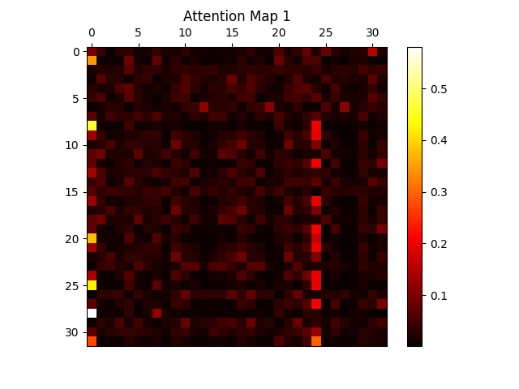
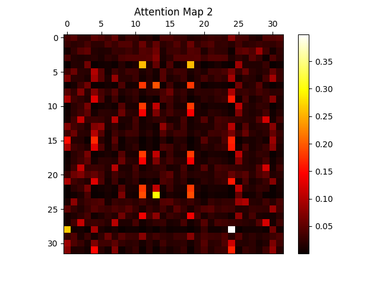
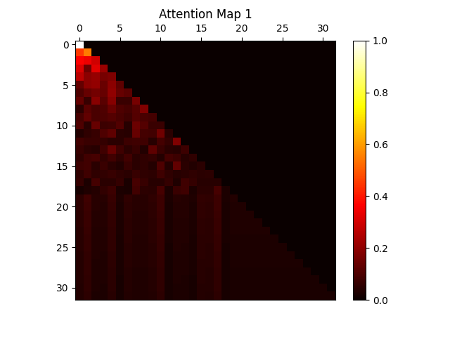
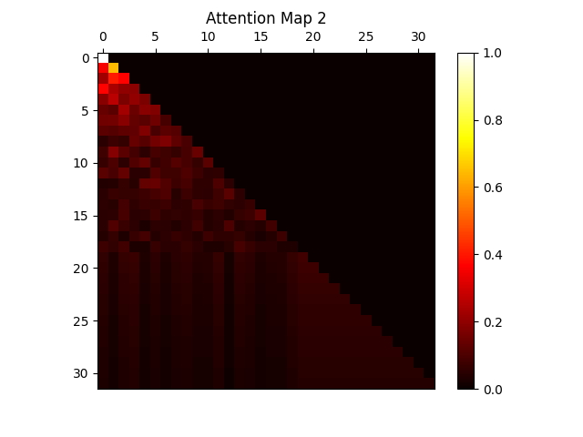

# Transformer Blocks

## Overview
This project implements different components of the Transformer architecture from scratch. The project consists of two main parts:

1. [**Transformer Encoder with Classifier:**](#classifier) A Transformer encoder is trained jointly from scratch alongside a feedforward classifier to predict which politician delivered a given speech segment.
2. [**GPT-like Transformer Decoder:**](#decoder-for-analyzation-of-perplexity) A word-level decoder is pretrained on an autoregressive language modeling task, reporting perplexity on different politicians' speeches.

__Note:__ no libraries were used to create these (more or less, pytorch was used for example), Encoder/Decoder-library was used to import pre-made blocks for this project. The attention-mechanisms were all programmed.


## Classifier
The Classifier is contructed of one encoder containing mulitple heads (allowing every head to learn something different), and one neural network.
The input is first passed through the encoder, then to the neural network which has three outputs (one for every president) belonging to the odds that it is the specific president who has said the given input string.

__training:__ the classifier was trained using a about 2000 strings each containing to one of the three presidents. which president the string belonged to was indicated by a number in the ragne of 0 - 2 inclusive.

(the "1" here indicates which president...)
```plaintext
1	I call him Big George, Jorge el Grande.
```

### Attention map for encoder:
here is an attention map for the encoder in the classifier. It looks correct since we can see that each token looks at both past and future tokens when assesing its context. 

we can also see that the attention map for the two different heads are different, indicating that they have indeed learned different things. This is good! because we have to consider different perspectives when trying to understand the context of token.

__Head 1:__




__Head 2:__



## Decoder for analyzation of perplexity
A decodr is ideal for autoregressive language modeling since it predicts the next token

__training:__ The decoder was pretrained using one long text with speeches from all three presidents

```plaintext
It is costly and politically difficult to continue this conflict.
More of you have lost ...
...more..more...
```


### Attention map for encoder:
A note here is that we can see how each token only looks at previous token to predict the next token (main difference from encoder). this makes sense since there wouldn't be much to predict if we were able to look at future tokens when predicting them.
__Head 1:__




__Head 2:__




## Getting Started
### Prerequisites
Ensure you have the following dependencies installed:
- Python 3.x
- PyTorch
- NumPy
- NLTK
- Matplotlib (for visualization)

You can install the required libraries using:
```bash
pip install torch numpy nltk matplotlib
```


### make

```bash
python main.py --part1
```

Expected accuracy: \~80% on test set.

### Part 2: Transformer Decoder for Language Modeling

Pretrain and evaluate the decoder:

```bash
python main.py --part2
```

Expected perplexity:

- Training set: \~100s
- Test sets: \~300-400s

## Evaluation and Reporting

- **Attention Visualization**: Use `utilities.py` to validate attention matrices.
- **Performance Metrics**:
  - Accuracy for classification (reported after each epoch up to 15 epochs).
  - Perplexity for language modeling (reported after every 100 iterations up to 500 iterations).
- **Model Parameters**: Number of parameters for both encoder and decoder should be included in the report.
